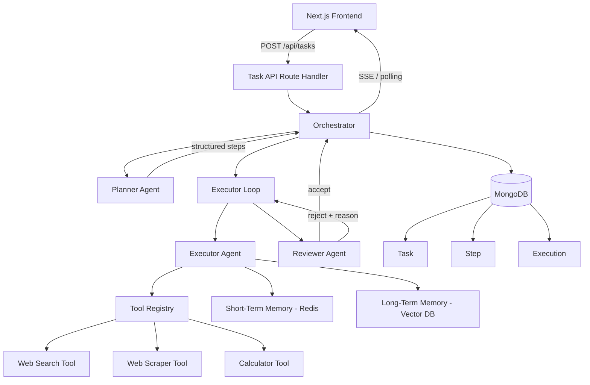
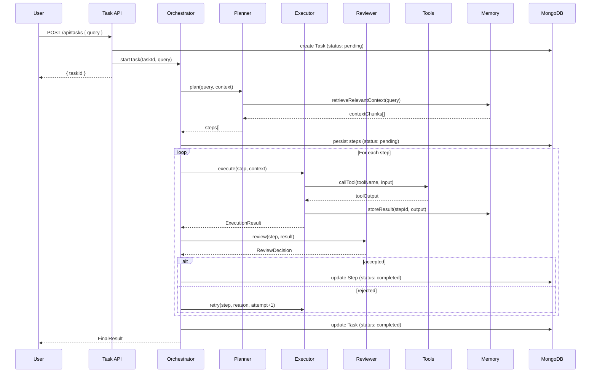
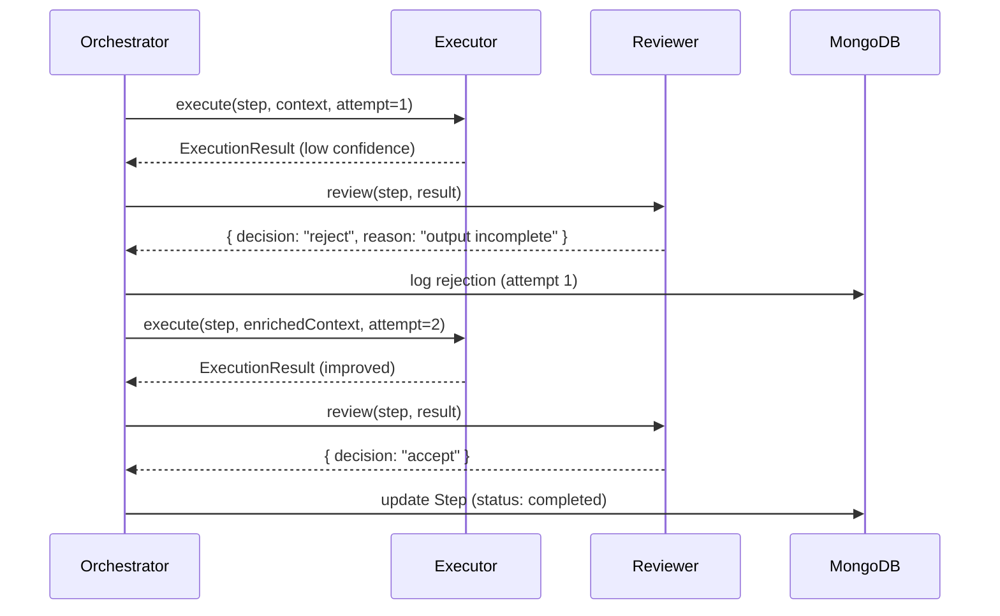

# Design Document: Multi-Agent AI Task Automation System

## Overview

This system accepts a high-level user request and autonomously decomposes it into ordered, atomic steps, executes each step using specialized tools, validates outputs, and iterates until a final structured result is produced. It is a goal-driven, agent-based autonomous system — not a chatbot — built on a TypeScript-first full-stack architecture using Next.js, MongoDB, Redis, and a vector database for semantic memory.

The architecture is composed of three core agents (Planner, Executor, Reviewer) coordinated by an orchestration layer, supported by a pluggable tool system, a dual-layer memory system (short-term Redis + long-term vector DB), and a persistent MongoDB data store. Every agent action is logged, every execution is traceable, and the system is designed for modularity and extensibility.

The system enforces tool-based execution over raw LLM inference, avoids hardcoded workflows, and supports optional parallel step execution and dynamic replanning for advanced use cases.

---

## Architecture



---

## Sequence Diagrams

### Main Task Execution Flow



### Retry Flow



---

## Components and Interfaces

### Orchestrator

**Purpose**: Central coordinator that drives the full task lifecycle — from planning through execution to final result assembly.

**Interface**:
```typescript
interface Orchestrator {
  startTask(taskId: string, query: string): Promise<FinalResult>
  getTaskStatus(taskId: string): Promise<TaskStatus>
  abortTask(taskId: string): Promise<void>
}
```

**Responsibilities**:
- Invoke Planner to decompose the query into steps
- Manage the executor loop with retry logic
- Invoke Reviewer after each execution
- Persist state transitions to MongoDB
- Emit progress events for frontend polling/SSE

---

### Planner Agent

**Purpose**: Decomposes a high-level user query into an ordered array of atomic, executable steps.

**Interface**:
```typescript
interface PlannerAgent {
  plan(query: string, context: PlannerContext): Promise<PlannedStep[]>
}

interface PlannerContext {
  relevantMemory: MemoryChunk[]
  previousTaskSummaries?: string[]
}

interface PlannedStep {
  order: number
  description: string
  suggestedTool: ToolName | null
  expectedOutputSchema: JSONSchema
}
```

**Responsibilities**:
- Query vector memory for relevant prior context
- Construct a structured prompt with the query and context
- Parse and validate the LLM response into `PlannedStep[]`
- Ensure steps are atomic, ordered, and non-overlapping

---

### Executor Agent

**Purpose**: Executes a single step by selecting and invoking the appropriate tool, then returns a structured result.

**Interface**:
```typescript
interface ExecutorAgent {
  execute(step: Step, context: ExecutionContext, attempt: number): Promise<ExecutionResult>
}

interface ExecutionContext {
  previousResults: ExecutionResult[]
  shortTermMemory: Record<string, unknown>
  taskQuery: string
}

interface ExecutionResult {
  stepId: string
  toolUsed: ToolName
  input: Record<string, unknown>
  output: unknown
  status: "success" | "failure"
  logs: string[]
  confidence: number  // 0-1
  createdAt: Date
}
```

**Responsibilities**:
- Select the best tool for the step (via LLM or rule-based routing)
- Invoke the tool with structured input
- Store result in short-term Redis memory
- Return structured `ExecutionResult` with logs and confidence score

---

### Reviewer Agent

**Purpose**: Validates an execution result against the step's expected output schema and the original task goal.

**Interface**:
```typescript
interface ReviewerAgent {
  review(step: Step, result: ExecutionResult, taskQuery: string): Promise<ReviewDecision>
}

interface ReviewDecision {
  decision: "accept" | "reject"
  reason: string
  suggestions?: string[]
  confidence: number
}
```

**Responsibilities**:
- Validate output structure against `expectedOutputSchema`
- Assess relevance to the original task query
- Return actionable rejection reasons and suggestions for retry
- Accept results that meet quality threshold

---

### Tool Registry

**Purpose**: Central registry for all available tools; provides tool lookup and invocation.

**Interface**:
```typescript
interface ToolRegistry {
  getTool(name: ToolName): Tool
  listTools(): ToolMetadata[]
  invoke(name: ToolName, input: ToolInput): Promise<ToolOutput>
}

interface Tool {
  name: ToolName
  description: string
  inputSchema: JSONSchema
  outputSchema: JSONSchema
  execute(input: ToolInput): Promise<ToolOutput>
}

type ToolName = "web_search" | "web_scraper" | "calculator"

interface ToolInput {
  [key: string]: unknown
}

interface ToolOutput {
  result: unknown
  metadata: Record<string, unknown>
  error?: string
}
```

---

### Memory System

**Purpose**: Dual-layer memory providing fast short-term context (Redis) and semantic long-term retrieval (vector DB).

**Interface**:
```typescript
interface MemorySystem {
  storeShortTerm(key: string, value: unknown, ttlSeconds?: number): Promise<void>
  getShortTerm(key: string): Promise<unknown>
  storeLongTerm(content: string, metadata: MemoryMetadata): Promise<void>
  retrieveRelevant(query: string, topK?: number): Promise<MemoryChunk[]>
}

interface MemoryMetadata {
  taskId: string
  stepId?: string
  type: "task_result" | "step_output" | "user_context"
  createdAt: Date
}

interface MemoryChunk {
  content: string
  metadata: MemoryMetadata
  score: number  // cosine similarity
}
```

---

## Data Models

### Task

```typescript
interface ITask {
  _id: ObjectId
  userQuery: string
  status: "pending" | "planning" | "executing" | "reviewing" | "completed" | "failed"
  steps: ObjectId[]
  finalResult?: FinalResult
  errorMessage?: string
  createdAt: Date
  updatedAt: Date
}

interface FinalResult {
  summary: string
  data: unknown
  stepResults: ExecutionResult[]
}
```

**Validation Rules**:
- `userQuery` must be non-empty string, max 2000 chars
- `status` must be one of the defined enum values
- `steps` array populated after planning phase

---

### Step

```typescript
interface IStep {
  _id: ObjectId
  taskId: ObjectId
  description: string
  order: number
  status: "pending" | "executing" | "completed" | "failed" | "skipped"
  suggestedTool: ToolName | null
  expectedOutputSchema: JSONSchema
  executions: ObjectId[]
  finalExecutionId?: ObjectId
  createdAt: Date
  updatedAt: Date
}
```

**Validation Rules**:
- `order` must be a non-negative integer, unique within a task
- `description` must be non-empty
- `executions` array grows with each attempt

---

### Execution

```typescript
interface IExecution {
  _id: ObjectId
  stepId: ObjectId
  attempt: number
  toolUsed: ToolName
  input: Record<string, unknown>
  output: unknown
  status: "success" | "failure"
  reviewDecision?: ReviewDecision
  logs: string[]
  confidence: number
  createdAt: Date
}
```

**Validation Rules**:
- `attempt` starts at 1, increments on retry
- `confidence` is a float in [0, 1]
- `logs` is an append-only array of timestamped strings

---

## Algorithmic Pseudocode

### Main Orchestration Algorithm

```typescript
async function orchestrateTask(taskId: string, query: string): Promise<FinalResult> {
  // Preconditions:
  //   taskId is a valid, persisted Task document ID
  //   query is a non-empty string
  // Postconditions:
  //   Task status is "completed" or "failed"
  //   All steps have a terminal status
  //   FinalResult is persisted to Task document

  await updateTaskStatus(taskId, "planning")

  const context = await memory.retrieveRelevant(query, topK=5)
  const plannedSteps = await planner.plan(query, { relevantMemory: context })

  await persistSteps(taskId, plannedSteps)
  await updateTaskStatus(taskId, "executing")

  const allResults: ExecutionResult[] = []

  // Loop invariant: all steps before index i are in terminal status
  for (const step of plannedSteps) {
    const result = await executeWithRetry(step, allResults, query)

    if (result.status === "failure") {
      await updateTaskStatus(taskId, "failed")
      throw new TaskExecutionError(step, result)
    }

    allResults.push(result)
    await updateStepStatus(step._id, "completed", result)
  }

  const finalResult = assembleFinalResult(query, allResults)
  await updateTaskStatus(taskId, "completed", finalResult)

  return finalResult
}
```

**Preconditions:**
- `taskId` references a valid Task document with status `"pending"`
- `query` is a non-empty, validated string

**Postconditions:**
- Task status transitions to `"completed"` or `"failed"`
- Every step has a terminal status (`"completed"`, `"failed"`, or `"skipped"`)
- `FinalResult` is persisted on the Task document

**Loop Invariants:**
- All steps at index `< i` are in a terminal status before step `i` begins
- `allResults` contains exactly one result per completed step

---

### Execute With Retry Algorithm

```typescript
async function executeWithRetry(
  step: Step,
  previousResults: ExecutionResult[],
  taskQuery: string,
  maxAttempts: number = 3
): Promise<ExecutionResult> {
  // Preconditions:
  //   step is a valid Step with status "pending"
  //   maxAttempts >= 1
  // Postconditions:
  //   Returns ExecutionResult with status "success" or "failure"
  //   All attempts are persisted as Execution documents

  let attempt = 1
  let lastResult: ExecutionResult | null = null

  // Loop invariant: attempt <= maxAttempts + 1
  while (attempt <= maxAttempts) {
    const context: ExecutionContext = {
      previousResults,
      shortTermMemory: await memory.getShortTerm(`task:${step.taskId}`),
      taskQuery,
      rejectionReason: lastResult?.reviewDecision?.reason
    }

    await updateStepStatus(step._id, "executing")
    const result = await executor.execute(step, context, attempt)
    await persistExecution(step._id, result)

    const review = await reviewer.review(step, result, taskQuery)
    result.reviewDecision = review

    if (review.decision === "accept") {
      return result
    }

    // Rejected: log and increment
    await logRejection(step._id, attempt, review.reason)
    lastResult = result
    attempt++
  }

  // All attempts exhausted
  return { ...lastResult!, status: "failure" }
}
```

**Preconditions:**
- `step.status === "pending"`
- `maxAttempts >= 1`

**Postconditions:**
- Returns a result with `status === "success"` if any attempt was accepted
- Returns a result with `status === "failure"` if all attempts were rejected
- Every attempt is persisted as an `Execution` document

**Loop Invariants:**
- `attempt` is strictly increasing on each iteration
- `attempt <= maxAttempts + 1` at the start of each iteration
- Each iteration produces exactly one `Execution` document

---

### Planner Algorithm

```typescript
async function plan(query: string, context: PlannerContext): Promise<PlannedStep[]> {
  // Preconditions:
  //   query is non-empty
  //   context.relevantMemory is a valid (possibly empty) array
  // Postconditions:
  //   Returns array of PlannedStep with unique, sequential order values
  //   Each step has a non-empty description

  const systemPrompt = buildPlannerSystemPrompt()
  const userPrompt = buildPlannerUserPrompt(query, context.relevantMemory)

  const rawResponse = await openai.chat.completions.create({
    model: "gpt-4o",
    messages: [
      { role: "system", content: systemPrompt },
      { role: "user", content: userPrompt }
    ],
    response_format: { type: "json_object" }
  })

  const parsed = JSON.parse(rawResponse.choices[0].message.content!)
  const steps = validateAndNormalizePlan(parsed)

  // Postcondition assertion
  assert(steps.every((s, i) => s.order === i + 1), "Steps must be sequentially ordered")
  assert(steps.every(s => s.description.length > 0), "All steps must have descriptions")

  return steps
}
```

---

### Tool Selection Algorithm

```typescript
async function selectTool(step: Step, context: ExecutionContext): Promise<ToolName> {
  // Preconditions:
  //   step.description is non-empty
  //   toolRegistry has at least one registered tool
  // Postconditions:
  //   Returns a valid ToolName registered in toolRegistry

  // Fast path: use suggested tool if provided and valid
  if (step.suggestedTool && toolRegistry.getTool(step.suggestedTool)) {
    return step.suggestedTool
  }

  // LLM-based tool selection
  const availableTools = toolRegistry.listTools()
  const prompt = buildToolSelectionPrompt(step.description, availableTools, context)

  const response = await openai.chat.completions.create({
    model: "gpt-4o-mini",
    messages: [{ role: "user", content: prompt }],
    response_format: { type: "json_object" }
  })

  const { toolName } = JSON.parse(response.choices[0].message.content!)

  assert(toolRegistry.getTool(toolName) !== undefined, `Selected tool "${toolName}" must be registered`)

  return toolName as ToolName
}
```

---

## Key Functions with Formal Specifications

### `assembleFinalResult()`

```typescript
function assembleFinalResult(
  taskQuery: string,
  stepResults: ExecutionResult[]
): FinalResult
```

**Preconditions:**
- `taskQuery` is non-empty
- `stepResults` is non-empty and all results have `status === "success"`
- Results are ordered by step `order` ascending

**Postconditions:**
- Returns a `FinalResult` with a non-empty `summary`
- `finalResult.stepResults` contains all input results
- `finalResult.data` is a structured aggregation of all step outputs

---

### `validateAndNormalizePlan()`

```typescript
function validateAndNormalizePlan(raw: unknown): PlannedStep[]
```

**Preconditions:**
- `raw` is a parsed JSON object from the LLM response

**Postconditions:**
- Returns `PlannedStep[]` where every step has `order`, `description`, and `suggestedTool`
- Steps are sorted by `order` ascending
- Throws `PlanValidationError` if required fields are missing or malformed

**Loop Invariants:**
- For each step validated, all previously validated steps remain valid

---

### `buildPlannerUserPrompt()`

```typescript
function buildPlannerUserPrompt(
  query: string,
  memoryChunks: MemoryChunk[]
): string
```

**Preconditions:**
- `query` is non-empty
- `memoryChunks` is a valid array (may be empty)

**Postconditions:**
- Returns a non-empty string prompt
- Prompt includes the query and any relevant memory context
- Prompt instructs the LLM to return JSON with a `steps` array

---

### `storeShortTerm()` / `getShortTerm()`

```typescript
async function storeShortTerm(key: string, value: unknown, ttlSeconds?: number): Promise<void>
async function getShortTerm(key: string): Promise<unknown>
```

**Preconditions (`storeShortTerm`):**
- `key` is a non-empty string
- `value` is JSON-serializable

**Postconditions (`storeShortTerm`):**
- Value is stored in Redis under `key`
- If `ttlSeconds` is provided, key expires after that duration

**Preconditions (`getShortTerm`):**
- `key` is a non-empty string

**Postconditions (`getShortTerm`):**
- Returns the stored value if key exists, `null` otherwise
- Does not throw on cache miss

---

## Example Usage

```typescript
// 1. Create a task via API
const response = await fetch("/api/tasks", {
  method: "POST",
  headers: { "Content-Type": "application/json" },
  body: JSON.stringify({ query: "Research the top 3 AI frameworks in 2024 and summarize their pros and cons" })
})
const { taskId } = await response.json()
// => { taskId: "64f3a1b2c3d4e5f6a7b8c9d0" }

// 2. Poll task status
const status = await fetch(`/api/tasks/${taskId}`)
const task = await status.json()
// => { status: "executing", steps: [...], progress: 2/5 }

// 3. Get final result
const result = await fetch(`/api/tasks/${taskId}/result`)
const finalResult = await result.json()
// => {
//   summary: "Top 3 AI frameworks in 2024: ...",
//   data: { frameworks: [...] },
//   stepResults: [...]
// }

// 4. Direct orchestrator usage (server-side)
const orchestrator = new Orchestrator({ planner, executor, reviewer, memory, db })
const finalResult = await orchestrator.startTask(taskId, query)
```

---

## Correctness Properties

- For all tasks T: if T.status === "completed", then every step in T.steps has status === "completed"
- For all steps S: S.executions.length >= 1 when S.status is terminal
- For all executions E: E.attempt >= 1 and E.attempt <= maxAttempts
- For all planned step arrays P: step orders form a contiguous sequence starting at 1
- For all tool invocations: the tool name used is registered in the ToolRegistry at invocation time
- For all ReviewDecisions: decision is exactly "accept" or "reject", never undefined
- For all retry loops: the loop terminates because attempt is strictly increasing and bounded by maxAttempts
- Memory retrieval is non-destructive: retrieveRelevant(q) does not modify stored memory
- Short-term memory keys are namespaced by taskId to prevent cross-task contamination

---

## Error Handling

### Scenario 1: Planner Returns Invalid JSON

**Condition**: LLM response cannot be parsed or fails schema validation
**Response**: Throw `PlanValidationError` with the raw response attached; mark Task as `"failed"`
**Recovery**: Surface error to user with a descriptive message; allow task retry

### Scenario 2: Tool Execution Failure

**Condition**: A tool throws an exception (network error, timeout, invalid input)
**Response**: Catch error in Executor, set `ExecutionResult.status = "failure"`, log the error in `logs[]`
**Recovery**: Reviewer receives the failed result; retry logic kicks in up to `maxAttempts`

### Scenario 3: Max Retries Exceeded

**Condition**: Reviewer rejects all `maxAttempts` executions of a step
**Response**: Mark Step as `"failed"`, mark Task as `"failed"`, persist final rejection reason
**Recovery**: Return structured error to user with the last rejection reason and suggestions

### Scenario 4: Vector DB Unavailable

**Condition**: Pinecone (or similar) is unreachable during memory retrieval
**Response**: Log warning, proceed with empty memory context (graceful degradation)
**Recovery**: Planner operates without prior context; system continues without long-term memory

### Scenario 5: Redis Unavailable

**Condition**: Redis connection fails during short-term memory read/write
**Response**: Log error, fall back to in-memory Map for the duration of the task
**Recovery**: Task completes with degraded caching; no data loss for primary MongoDB records

### Scenario 6: OpenAI Rate Limit / API Error

**Condition**: OpenAI API returns 429 or 5xx
**Response**: Implement exponential backoff with jitter (max 3 retries, base delay 1s)
**Recovery**: If all retries fail, mark the current step as `"failed"` and propagate

---

## Testing Strategy

### Unit Testing Approach

Each agent and tool is tested in isolation with mocked dependencies:
- `PlannerAgent`: mock OpenAI responses, assert `PlannedStep[]` structure and ordering
- `ExecutorAgent`: mock ToolRegistry, assert `ExecutionResult` shape and log population
- `ReviewerAgent`: mock step + result pairs, assert `ReviewDecision` correctness
- Tools: mock external APIs (search, scraper), assert `ToolOutput` schema compliance
- Memory: mock Redis and Pinecone clients, assert store/retrieve round-trips

### Property-Based Testing Approach

**Property Test Library**: `fast-check`

Key properties to test:
- `validateAndNormalizePlan(raw)` always returns steps with unique, sequential order values for any valid input shape
- `executeWithRetry` always terminates within `maxAttempts` iterations regardless of reviewer decisions
- Tool input/output schemas are always satisfied: for any valid `ToolInput`, `ToolOutput` matches the declared `outputSchema`
- Memory namespacing: storing under `taskId:A` never affects retrieval under `taskId:B` for any two distinct task IDs
- `assembleFinalResult` is deterministic: same inputs always produce structurally equivalent outputs

### Integration Testing Approach

- Full task lifecycle test: POST task → poll status → GET result, using a real MongoDB test instance and mocked OpenAI/tools
- Retry flow test: configure Reviewer mock to reject N times, assert exactly N+1 Execution documents are created
- Memory integration: store a result, retrieve by semantic query, assert top result matches stored content

---

## Performance Considerations

- **Parallel Step Execution**: Steps with no data dependencies can be executed concurrently using `Promise.all`. The Planner should annotate steps with dependency metadata to enable this.
- **Redis Caching**: Tool results for identical inputs (e.g., same search query) are cached in Redis with a configurable TTL to avoid redundant API calls.
- **Streaming Results**: Use Server-Sent Events (SSE) on `GET /api/tasks/:id/result` to stream step completions to the frontend in real time rather than polling.
- **LLM Model Tiering**: Use `gpt-4o-mini` for tool selection and review (lower cost, sufficient accuracy); use `gpt-4o` only for planning and final result assembly.
- **MongoDB Indexing**: Index `Task._id`, `Step.taskId + order`, and `Execution.stepId` for efficient query patterns.

---

## Security Considerations

- **Input Sanitization**: Validate and sanitize `userQuery` before passing to any LLM prompt to prevent prompt injection.
- **Tool Input Validation**: All tool inputs are validated against their declared `inputSchema` (JSON Schema) before execution.
- **API Authentication**: Task API routes require authentication (JWT or session); tasks are scoped to the authenticated user.
- **Rate Limiting**: Redis-based rate limiting on `POST /api/tasks` per user (e.g., 10 tasks/minute).
- **Scraper Sandboxing**: Playwright-based scraper runs in a sandboxed environment; URL allowlist/denylist enforced before scraping.
- **Secret Management**: OpenAI API keys, MongoDB URIs, and Redis credentials are stored in environment variables, never in code.
- **Output Sanitization**: Final results are sanitized before rendering in the frontend to prevent XSS.

---

## Dependencies

| Dependency | Purpose |
|---|---|
| `next` | Full-stack framework (App Router, API Routes) |
| `typescript` | Strict-mode type safety throughout |
| `openai` | OpenAI API client for LLM calls |
| `mongoose` | MongoDB ODM for Task, Step, Execution models |
| `ioredis` | Redis client for short-term memory and caching |
| `@pinecone-database/pinecone` | Vector DB client for long-term semantic memory |
| `playwright` | Headless browser for web scraper tool |
| `zod` | Runtime schema validation for tool I/O and API inputs |
| `fast-check` | Property-based testing library |
| `tailwindcss` | Utility-first CSS for frontend |
| `shadcn/ui` | Optional UI component library |
| `docker` | Containerization for local dev and deployment |
